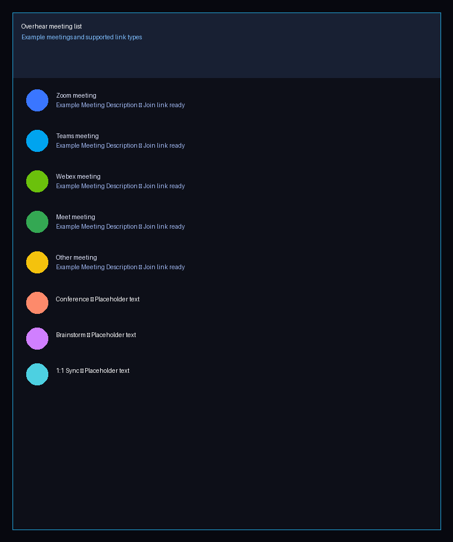
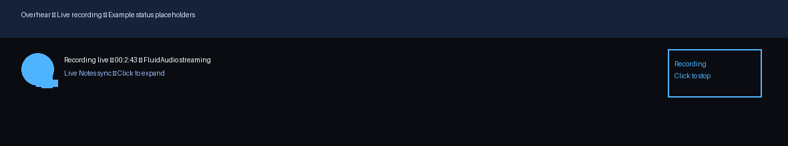
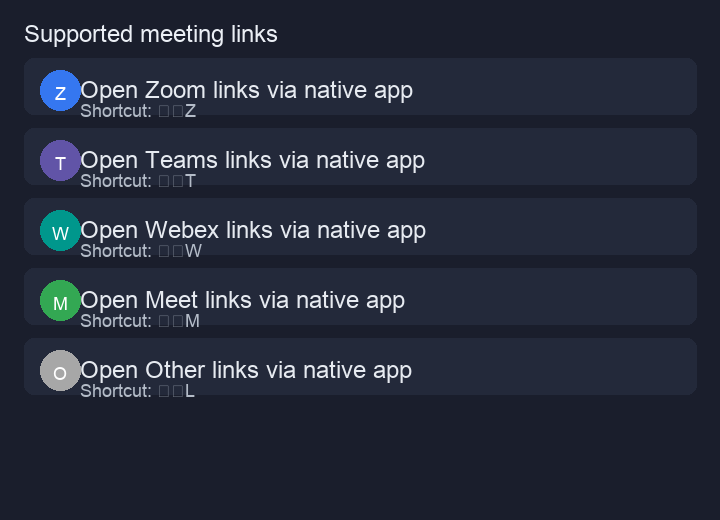

# Overhear

Overhear is a macOS menu bar app that makes your meetings effortless.

- **MVP:** Meeter-style menu bar launcher for calendar meetings.
- **Phase 1:** Granola-style live transcription + subtitle mode.
- **Phase 2:** Speaker labels, summaries, and action items.
- **Phase 3:** Local noise cancellation.
- **Phase 4:** Integrations (GitHub, Notion, Confluence, etc).

All processing is **local-first** and privacy-conscious.

## Architecture & Pipeline

### Audio capture & transcription
- `AVAudioCaptureService` is a native AVAudioEngine-based actor that captures microphone audio and hands it to `MeetingRecordingPipeline`.
- The pipeline chains transcription (Whisper by default, FluidAudio when `OVERHEAR_USE_FLUIDAUDIO=1`), diarization, and summarization before persisting transcripts via `TranscriptStore`.
- Transcripts are encrypted with AES-GCM before hitting disk so local storage never contains plaintext meeting data.
- When `OVERHEAR_FILE_LOGS=1` (or the persisted `overhear.enableFileLogs` setting) is enabled, capture startup, completion, and errors append diagnostic entries to `/tmp/overhear.log`, making it easy to verify permission dialogs and recording handoffs.

### Insights & summarization
- FluidAudio is the on-device ASR + diarization engine powering Phase 1 transcription and speaker analysis; it downloads CoreML bundles into `~/Library/Application Support/FluidAudio/Models`, with overrides available via environment variables.
- Meeting summaries and action items are produced post-meeting by a local MLX runtime using a compact quantized model such as SmolLM2-1.7B-Instruct or Llama 3.2 1B Instruct.
- Output includes a concise summary, highlight bullets, and a JSON list of action items with owners, descriptions, and due dates.

## Screenshots

## Roadmap

### MVP — Meeter Clone
- Menu bar upcoming meetings
- Scroll up for past meetings
- Click to join meetings
- Countdown to next meeting
- Calendar preferences
- Notifications + hotkeys
- Open rules for Zoom/Meet/Teams/Webex

### Phase 1 — Granola Clone
- Auto-start audio capture on join
- Real-time subtitles (floating window)
- Whisper-based streaming transcription
- Transcript storage and viewer

### Phase 2 — Insights
- Speaker diarization
- Meeting summaries
- Action items
- Search across transcripts

### Phase 3 — Noise Cancellation
- Local real-time noise suppression
- Optional virtual audio device

### Phase 4 — Integrations
- GitHub
- Notion
- Confluence
- Slack

## Requirements
- macOS 14+ on Apple Silicon (Big Sur or later clients may still be supported, but new AVAudio/FluidAudio flows assume macOS 14 APIs).
- Accessibility permissions for the global hotkeys.
- Calendar access so the menu bar can read/launch events, and Notification permission for reminders.
- The local MLX runtime expects small low-memory models (SmolLM2 1.7B or Llama 3.2 1B) and runs fully offline.

## Developer toggles

- `OVERHEAR_USE_FLUIDAUDIO=1` — enable FluidAudio for batch ASR plus diarization. The first launch downloads ~1 GB of CoreML models to `~/Library/Application Support/FluidAudio/Models`.
- `OVERHEAR_DISABLE_TRANSCRIPT_STORAGE=1` — run without writing transcripts to disk (search UI shows a banner).
- `OVERHEAR_FILE_LOGS=1` — append diagnostic logs to `/tmp/overhear.log` for meeting fetch/open flows and audio capture lifecycle events.
- `OVERHEAR_FLUIDAUDIO_ASR_VERSION={v2|v3}` — choose the Parakeet v2 (English-only) or v3 (multilingual) bundle when FluidAudio is enabled.
- `OVERHEAR_FLUIDAUDIO_ASR_MODELS=/path/to/models` — override FluidAudio’s ASR cache if you pre-stage downloaded bundles.
- `OVERHEAR_FLUIDAUDIO_DIARIZER_MODELS=/path/to/models` — override FluidAudio’s diarization cache if you host the models in a custom location.

### Live recording & manual capture

- The menu bar now shows a live recording banner with a blue mic badge whenever a capture is in progress. Clicking **Live Notes** opens the floating transcript + notes window that streams Hypothesis/confirmed text from FluidAudio’s `StreamingAsrManager`.
- Manual recordings create ad-hoc meetings that persist in the timeline, notify every 30 minutes while active, and display a tape icon once the transcript/summary exists. Calendar events stay visible for 5 minutes after their scheduled end so you can still one‑click join running meetings even when you’re late.
- Use `OVERHEAR_USE_FLUIDAUDIO=1` on an Apple Silicon machine to let FluidAudio download its models, stream updates, and write the live transcript entries to `/tmp/overhear.log`. This is the best way to smoke-test the streaming pipeline before cutting a release.

## FluidAudio configuration

- FluidAudio downloads models to `~/Library/Application Support/FluidAudio/Models/<repo>` the first time `OVERHEAR_USE_FLUIDAUDIO=1` is seen. You can point the ASR/diarization caches at pre-staged folders via the `OVERHEAR_FLUIDAUDIO_ASR_MODELS` and `OVERHEAR_FLUIDAUDIO_DIARIZER_MODELS` environment variables if your CI or release artifact already ships the CoreML bundles.
- Set `OVERHEAR_FLUIDAUDIO_ASR_VERSION=v2` for the English-optimized Parakeet v2 bundle or `v3` for the multilingual model **before the first launch or before models are downloaded** to select which bundle to fetch. If models have already been downloaded, changing this variable will not retroactively fetch a different bundle; you must remove the existing models and restart the app to trigger a new download.
