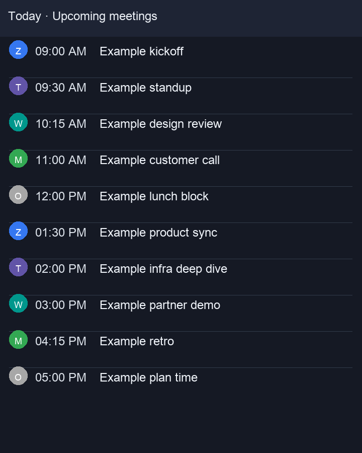

# Overhear

Overhear is a macOS menu bar app that makes your meetings effortless.

- **MVP:** Meeter-style menu bar launcher for calendar meetings.
- **Phase 1:** Granola-style live transcription + subtitle mode.
- **Phase 2:** Speaker labels, summaries, and action items.
- **Phase 3:** Local noise cancellation.
- **Phase 4:** Integrations (GitHub, Notion, Confluence, etc).

All processing is **local-first** and privacy-conscious.

## Screenshots

## Roadmap

### MVP — Meeter Clone
- Menu bar upcoming meetings
- Scroll up for past meetings
- Click to join meetings
- Countdown to next meeting
- Calendar preferences
- Notifications + hotkeys
- Open rules for Zoom/Meet/Teams/Webex

### Phase 1 — Granola Clone
- Auto-start audio capture on join
- Real-time subtitles (floating window)
- Whisper-based streaming transcription
- Transcript storage and viewer

### Phase 2 — Insights
- Speaker diarization
- Meeting summaries
- Action items
- Search across transcripts

### Phase 3 — Noise Cancellation
- Local real-time noise suppression
- Optional virtual audio device

### Phase 4 — Integrations
- GitHub
- Notion
- Confluence
- Slack

## Developer toggles

- `OVERHEAR_USE_FLUIDAUDIO=1` — opt into the FluidAudio transcription engine (stubbed; defaults to Whisper pipeline).
- `OVERHEAR_DISABLE_TRANSCRIPT_STORAGE=1` — run without writing transcripts to disk (search UI shows a banner).
- `OVERHEAR_FILE_LOGS=1` — append diagnostic logs to `/tmp/overhear.log` for meeting fetch/open flows.
